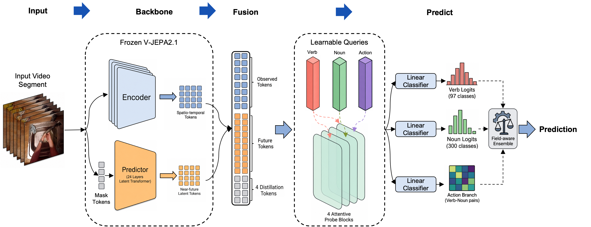

# JFAA for EPIC-KITCHENS-100 Action Anticipation @ EgoVis 2026

**JFAA** is the code scaffold for our **champion solution** in the
EPIC-KITCHENS-100 Action Anticipation Challenge @ EgoVis 2026.

JFAA stands for **J**EPA-based **F**uture **A**ction **A**nticipation. Instead
of fine-tuning the full video backbone, JFAA keeps the V-JEPA 2.1 ViT-G/384
encoder-predictor frozen, trains lightweight attentive probes for verb, noun,
and action prediction, then combines selected epoch-level submissions with a
field-aware ensemble.

## Result

Official open-testing leaderboard:

| Rank | Participant | Score |
| ---: | --- | ---: |
| **1** | **corrine (ours)** | **27.95** |
| 2 | sunshinesky | 27.91 |
| 3 | abardes | 25.05 |

The challenge page is hosted on Codabench:
https://www.codabench.org/competitions/14471/

`Score` is the official action Mean Top-5 Recall used for ranking. The full
leaderboard reported in the technical report is:

| Rank | Participant | Score | O-V | O-N | U-V | U-N | U-A | T-V | T-N | T-A |
| ---: | --- | ---: | ---: | ---: | ---: | ---: | ---: | ---: | ---: | ---: |
| **1** | **corrine** | **27.95** | 49.22 | **52.02** | **47.83** | **57.89** | 30.90 | 42.86 | 41.53 | **21.65** |
| 2 | sunshinesky | 27.91 | 49.19 | 51.97 | **47.83** | 57.78 | **30.93** | 42.82 | 41.46 | 21.60 |
| 3 | abardes | 25.05 | 49.56 | 48.57 | 46.32 | 54.43 | 26.95 | 43.48 | 38.27 | 19.16 |
| 4 | InAViT IHPC-AISG-LAHA | 23.75 | 49.14 | 49.97 | 44.36 | 49.28 | 23.49 | 43.17 | 39.91 | 18.11 |
| 5 | OA-OAD | 22.96 | **51.57** | 45.97 | 44.02 | 39.04 | 16.71 | **48.50** | **41.55** | 19.24 |

## Method Overview

<p align="center">
  
</p>

<p align="center">
  <em>Method framework from the JFAA technical report.</em>
</p>


## Repository Layout

```text
.
|-- README.md
|-- requirements.txt
|-- train_jfaa_probe.py
|-- evaluate_probe_heads.py
|-- export_submission.py
|-- ensemble_submissions.py
|-- configs/
|   |-- jfaa_vjepa2_vitG_train.yaml
|   `-- jfaa_vjepa2_vitG_infer.yaml
|-- docs/
|   `-- figures/
|       `-- method.png
|-- evals/
|   |-- main.py
|   |-- scaffold.py
|   `-- action_anticipation_frozen/
|       |-- dataloader.py
|       |-- epickitchens.py
|       |-- epickitchens_frames.py
|       |-- eval.py
|       |-- losses.py
|       |-- metrics.py
|       |-- models.py
|       |-- utils.py
|       `-- modelcustom/
|           `-- vit_encoder_predictor_concat_ar.py
|-- jfaa/
|   |-- __init__.py
|   |-- constants.py
|   `-- README.md
`-- scripts/
    `-- validate_code.sh
```

| File | Purpose |
| --- | --- |
| `train_jfaa_probe.py` | Thin launcher for probe training through `evals.main`. |
| `evaluate_probe_heads.py` | Evaluates finite probe heads on EK-100 validation data. |
| `export_submission.py` | Exports a Codabench-format `test.json` and flat zip archive. |
| `ensemble_submissions.py` | Builds field-aware ensembles from epoch-level submissions. |
| `evals/action_anticipation_frozen/` | V-JEPA2 frozen-backbone training/evaluation module. |
| `configs/*.yaml` | Public path templates for training and inference. |

## Setup

Clone V-JEPA2 and install its dependencies first:

```bash
git clone https://github.com/facebookresearch/vjepa2.git
cd vjepa2
pip install -e .
```

Install the additional lightweight dependencies used by this scaffold:

```bash
cd /path/to/JFAA
pip install -r requirements.txt
```

Run commands with both this repository and V-JEPA2 on `PYTHONPATH`:

```bash
export VJEPA2_ROOT=/path/to/vjepa2
export PYTHONPATH=$PWD:$VJEPA2_ROOT:$PYTHONPATH
```

Download the V-JEPA 2.1 ViT-G/384 checkpoint separately and point the config
field `model_kwargs.checkpoint` to it. Model checkpoints and EK-100 data are not
included in this repository.

## Data Preparation

Prepare the official EK-100 annotations and RGB frame folders. The scripts
expect:

```text
EPIC_100_train.csv
EPIC_100_validation.csv
EPIC_100_test_timestamps.csv
EPIC_100_video_info.csv
rgb frame folders, e.g. frame_0000000001.jpg
```

Update these fields in `configs/jfaa_vjepa2_vitG_train.yaml` and
`configs/jfaa_vjepa2_vitG_infer.yaml`:

```yaml
experiment:
  data:
    base_path: /path/to/EPIC-KITCHENS/rgb_frames
    dataset_train: /path/to/EPIC_100_train.csv
    dataset_val: /path/to/EPIC_100_validation.csv
    video_info_path: /path/to/EPIC_100_video_info.csv
model_kwargs:
  checkpoint: /path/to/vjepa2_1_vitG_384.pt
```

For test export, pass `--test-csv /path/to/EPIC_100_test_timestamps.csv` or
place that file next to the validation CSV.

## Step 1: Train JFAA Probe

Single node:

```bash
python train_jfaa_probe.py \
  --config configs/jfaa_vjepa2_vitG_train.yaml \
  --devices cuda:0 cuda:1 cuda:2 cuda:3
```

Direct V-JEPA2 launcher equivalent:

```bash
python -m evals.main \
  --fname configs/jfaa_vjepa2_vitG_train.yaml \
  --devices cuda:0 cuda:1 cuda:2 cuda:3
```

Checkpoints are written to:

```text
outputs/runs/ek100_vjepa2_1_vitG_384/action_anticipation_frozen/ek100-vjepa2_1-vitG-384/
```

## Step 2: Evaluate Probe Heads

Evaluate all finite probe heads on the validation split:

```bash
python evaluate_probe_heads.py \
  --config configs/jfaa_vjepa2_vitG_infer.yaml \
  --probe-checkpoint outputs/runs/ek100_vjepa2_1_vitG_384/action_anticipation_frozen/ek100-vjepa2_1-vitG-384/best.pt \
  --output-json outputs/val_head_metrics.json \
  --device cuda:0 \
  --batch-size 2
```


## Step 3: Export Epoch-Level Submission

Export one checkpoint/head to the official `test.json` format:

```bash
python export_submission.py \
  --config configs/jfaa_vjepa2_vitG_infer.yaml \
  --probe-checkpoint /path/to/epoch_XXX_best.pt \
  --test-csv /path/to/EPIC_100_test_timestamps.csv \
  --output-json outputs/submissions/epoch-XXX/predictions.json \
  --device cuda:0
```

By default, `export_submission.py` uses the `best_head` stored in the probe
checkpoint. This matches the report protocol: each epoch-level prediction is
exported from the best finite probe head selected on the validation split. Use
`--classifier-index` only when exporting a specific validation-selected head
manually.

## Swap Backbone: TimeSformer + LoRA

This repository now includes a plug-in module at
`evals.action_anticipation_frozen.modelcustom.timesformer_lora_backbone`
that follows the same output contract used by the current V-JEPA path.

Set your config like this:

```yaml
model_kwargs:
  checkpoint: null
  module_name: evals.action_anticipation_frozen.modelcustom.timesformer_lora_backbone
  wrapper_kwargs: {}
  pretrain_kwargs:
    # Option A: HF hub model id
    base_model_name: facebook/timesformer-base-finetuned-k400
    # Option B: local base model path
    # base_model_path: /path/to/base/timesformer

    # Optional LoRA adapter directory (PEFT format)
    lora_path: /path/to/timesformer/lora_adapter
    merge_lora: true

    # Output control for probe input tokens
    drop_cls_token: true
    temporal_pool: none   # none | mean
```

Notes:

- `temporal_pool: none` keeps dense patch tokens (recommended for attentive
  pooling probes).
- `temporal_pool: mean` collapses all tokens to one feature token and can be
  useful as a sanity baseline.
- Anticipation-time conditioning remains in the probe head path; this adapter
  intentionally keeps the backbone frozen and minimal.

## Step 4: Field-Aware Ensemble

Build final candidate submissions from selected epochs:

```bash
python ensemble_submissions.py \
  --submissions-dir outputs/submissions \
  --epochs XXX ...
```

Set `--epochs` to the exported epoch candidates you want to ensemble. If
`--quality-prior` is omitted, the script uses a uniform prior and still applies
per-sample field-aware confidence and consensus weighting separately for verb,
noun, and action. The script writes final ensemble candidates and a compact
summary under `outputs/submissions/`.

## Output Files

| Output | Description |
| --- | --- |
| `outputs/runs/.../best.pt` | Best attentive probe checkpoint. |
| `outputs/val_head_metrics.json` | Per-head validation MT5R and accuracy. |
| `outputs/submissions/epoch-XXX/` | Epoch-level prediction exports. |
| `outputs/submissions/ensemble_*/` | Field-aware ensemble candidates. |


## License

This repository is released under the MIT License. Portions of the V-JEPA2
evaluation scaffold are adapted from `facebookresearch/vjepa2` and retain their
original MIT license notices.
